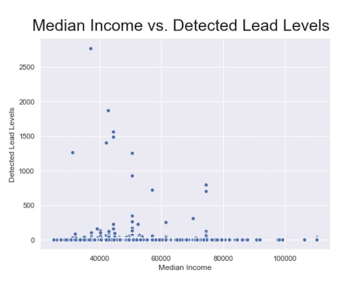
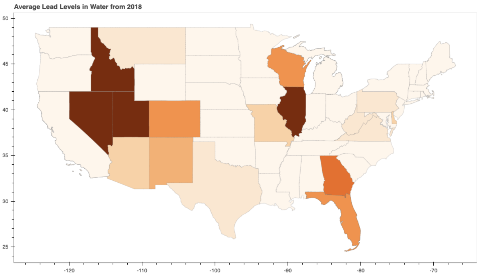

### Determining Whether Lead Levels are Uniform throughout the Contiguous United States

#### Data Sources
Lead, and other contaminates, levels for various countries can be found through Water Quality Portal from the United States Geological Survey government agency. 

#### Hypotheses
Our three null hypotheses that we will be testing are:
1. New York State water has had less lead contimination than the states of Illinois & California.
2. Water quality afforded to a county is correlated to median county income.
3. Water quality differs by region.

### Data Collection
Through the use of Selenium WebDriver, ZipFile, BeautifulSoup, and GeoPy, we were able to extract various relevant data points to aid in testing our null hypotheses. GeoPy was used to create an interactive map specifying the average lead levels from each county in a respective state (see below minus interactive features). We scraped median income by county for the contiguous 50 states as well as site identifiers from USGS to match county incomes to lead levels for counties with water quality data from USGS.

### ANOVA testing
With a p-value of < 0.001, we can assert that state affects lead levels in water to a statistically significant degree, thus we fail to reject the initial null hypothesis.

### Further Analysis
Having sufficient data for every county within every state (amassing roughly half of one million data points), would allow for better statistical analysis of the correlations between water quality and income as well as location/region. In having adequate samples, more statistical tests could be run to further explore our hypotheses. 
